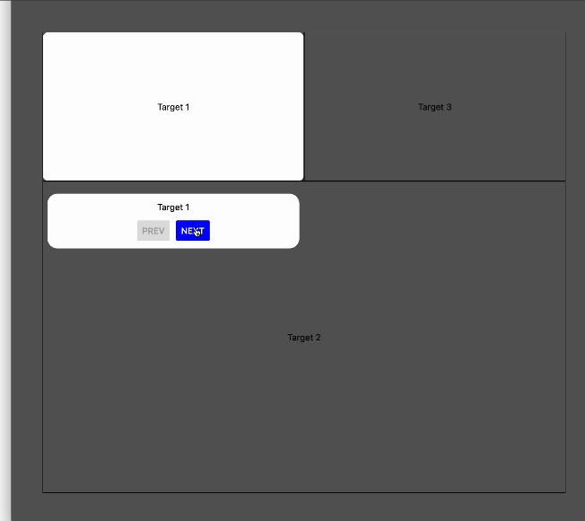

# react-native-interactive-tutorial

Interactive tutorial with step-by-step guide



## Installation

1. Install the main library:
```sh
yarn add react-native-interactive-tutorial
```

2. The library has peer dependencies, you should install them to your project: <br />
⚠️ ! Make sure that you have followed all the steps to install these libraries
```sh
yarn add react-native-reanimated react-native-gesture-handler react-native-safe-area-context react-native-svg
```

3. (Optional) You should use some storage library.
It can be any library, I use @react-native-async-storage/async-storage for an example.
```sh
yarn add @react-native-async-storage/async-storage
```

## Usage
Full example you [can find here](./example)

We can divide the usage into 4 parts:
1. Creating the root component in your project:

InteractiveTutorial.tsx:
```tsx
import { type PropsWithChildren, useCallback, useMemo } from 'react';

import AsyncStorage from '@react-native-async-storage/async-storage';
import { Button } from 'react-native';

import {
  type DescriptionCardProps,
  type SharedDescriptionCardButtonProps,
  InteractiveTutorialContainer,
  SharedDescriptionCard,
} from 'react-native-interactive-tutorial';


export enum TARGETS {
  Target1,
  Target2,
  Target3,
}

export default function InteractiveTutorial({ children }: PropsWithChildren) {
  // !! Here you can use different library
  const storage = useMemo(
    () => ({
      set: (_: boolean) => AsyncStorage.setItem('tutorial', String(_)),
      get: () => AsyncStorage.getItem('tutorial').then((_) => !!_),
    }),
    []
  );

  // !! Here are description be key dictionary
  const stack = useMemo(
    () =>
      new Map([
        [TARGETS.Target1, 'Target 1'],
        [TARGETS.Target2, 'Target 2'],
        [TARGETS.Target3, 'Target 3'],
      ]),
    []
  );

  // !! Translations (for description card)
  const translations = useMemo(
    () => ({
      prevButton: 'Prev',
      nextButton: 'Next',
      finishButton: 'Finish',
    }),
    []
  );

  return (
    <InteractiveTutorialContainer
      translations={translations}
      stack={stack}
      initialTarget={TARGETS.Target1}
      Card={DescriptionCard}
      storage={storage}
    >
      {children}
    </InteractiveTutorialContainer>
  );
}

// !! Here you can override description card with your own
const DescriptionCard = (props: DescriptionCardProps) => {
  const DescriptionButton = useCallback(
    ({ type, ...rest }: SharedDescriptionCardButtonProps) => (
      <Button {...rest} color={type === 'prev' ? 'darkblue' : 'blue'} />
    ),
    []
  );
  return <SharedDescriptionCard Button={DescriptionButton} {...props} />;
};

```

2. Wrapping your accented components
```tsx
// any places in your app
const target1 = useUiElement(TARGETS.Target1, (_) => addBorderRadius(_, 10));
<View
  style={[styles.column, styles.card]}
  ref={target1.ref} // !! necessary prop
  onLayout={target1.onLayout} // !! necessary prop
>
  <Text>Target 1</Text>
</View>
```

3. Creating hook to run the tutorial
```tsx
import { useEffect } from 'react';
import { useInteractiveTutorial } from 'react-native-interactive-tutorial';

export default function useTutorialRunner() {
  const tutorial = useInteractiveTutorial();

  useEffect(() => {
    if (tutorial.finished === false) {
      setTimeout(() => tutorial.show());
    }
  }, [tutorial]);
}
```

4. Wrapping your screen or app in the component from step1 and call the hook from step 3:
```tsx
function Root() {
  return (
    <SafeAreaProvider> // !! it's also necessary
      <InteractiveTutorial> // !! created component from step 1
        <App />
      </InteractiveTutorial>
    </SafeAreaProvider>
  );
}
```
Call the hook **inside** the App:
```tsx
function App() {
 useTutorialRunner();
 ...
}
```


## Contributing

See the [contributing guide](CONTRIBUTING.md) to learn how to contribute to the repository and the development workflow.

## License

MIT

---

Made with [create-react-native-library](https://github.com/callstack/react-native-builder-bob)
